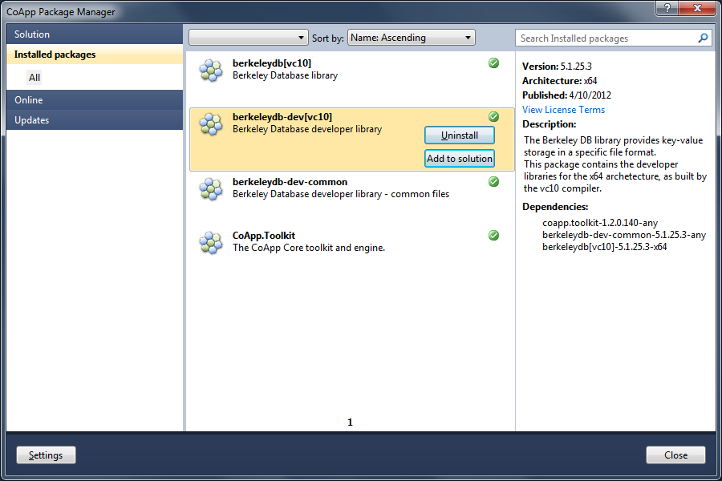

coapp-vsp-prototype
===================

Visual Studio plugin for CoApp packages

[X] List Packages
[X] Get Package Info
[X] Close Window
[X] Progress Bar

[ ] Activate Package (C#)
[ ] Activate Package (C++)
[ ] Packages.config, prompt required library installs

[ ] Install Package
[ ] Uninstall Package
[ ] Update Packages
[ ] Upgrade Packages
[X] List Feeds
[ ] Add Feed
[ ] Remove Feed

[ ] Options
[ ] Feed Configuration

[X] Search (local list)
[X] Sort (local list)
[X] Categories: installed, active, online, updates, recent
[X] Subcategories: all, libraries, tools

[ ] Command line toolbox
[ ] Update notifications
[ ] VsExtension

